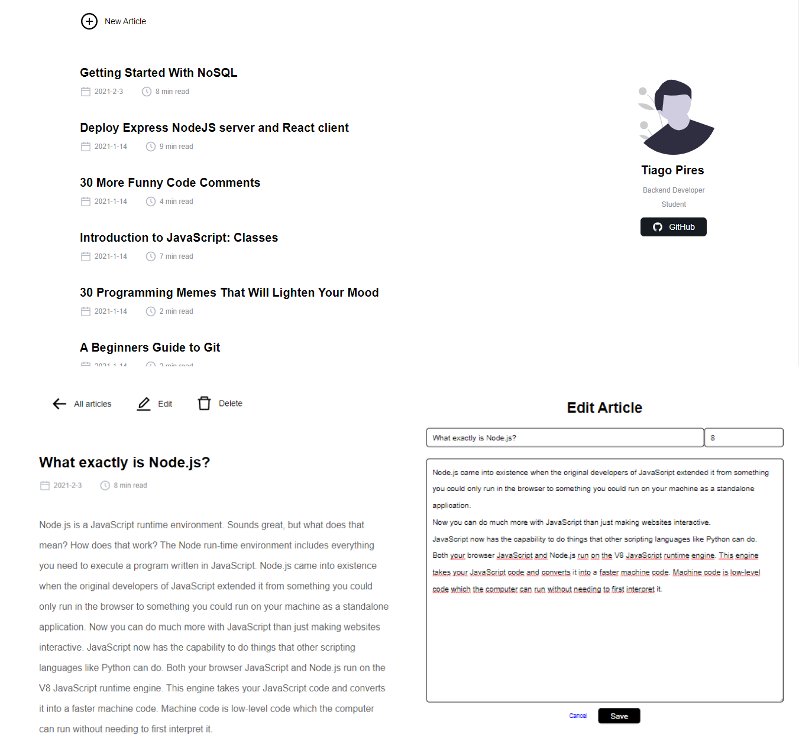

# Node.Js Blog

## About this Project
Node.js CRUD Aplication, made for create, read, edit and delete posts inside a blog

## Built With

 - [Node.Js](https://nodejs.org/en/) - Build
 - [Express](htts://expressjs.com/) - Routes Controller
 - [Ejs](https://ejs.co/) - View Engine
 - [MongoDB](https://www.mongodb.com/) - Database
 - [Mongoose](https://mongoosejs.com/) - Manage MongoDB Data
